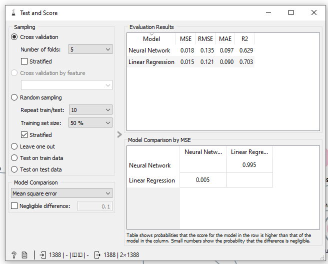
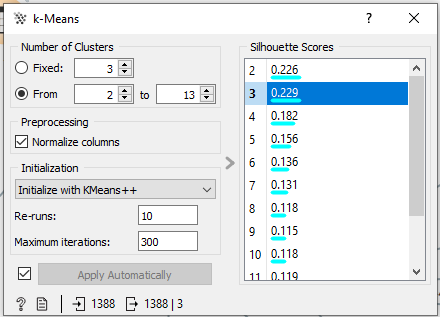
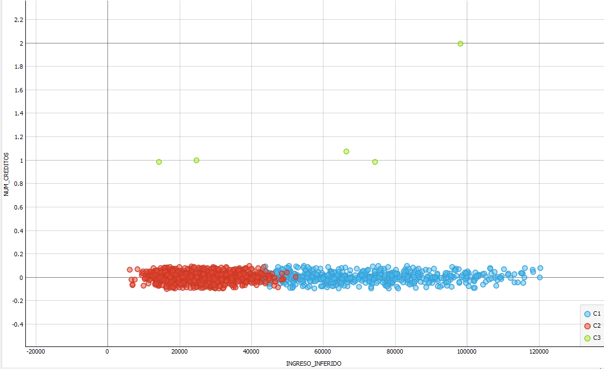
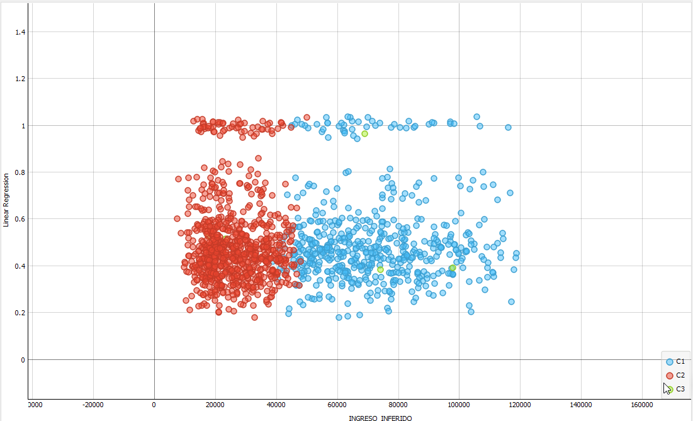
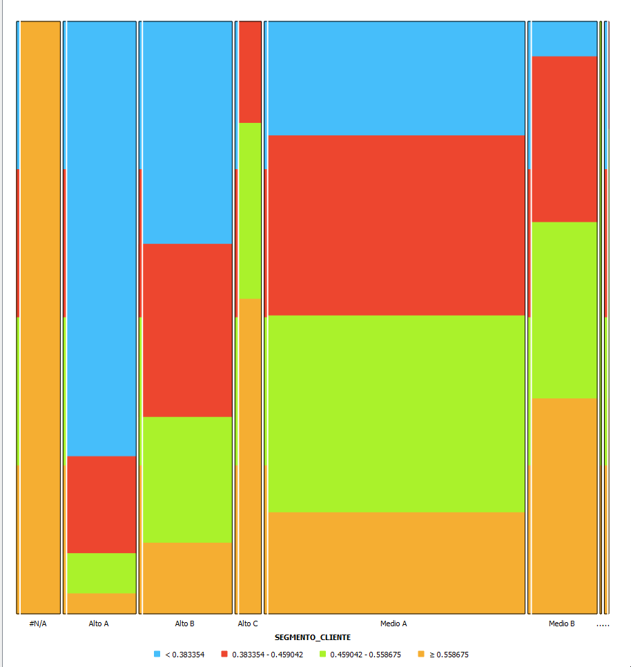
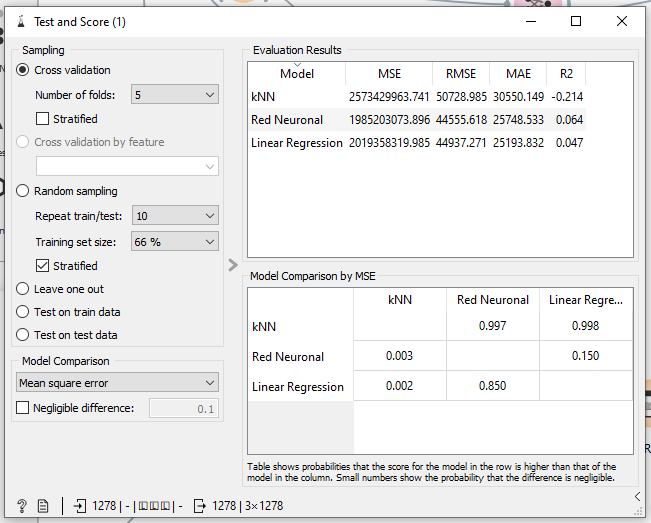

# Mineria de datos a datos bancarios
## Plan Propuesto

* Se busca el poder otorgar la mayor cantidad de créditos
* Cada crédito tiene un riesgo, por lo que se estimará dicho porcentaje de riesgo y con base al mismo se cobrará un interés.
* Se creará un sistema de preaprobación de créditos, esto para poder generar publicidad dirigida 
* Adicionalmente a la preaprobación se calculará una línea de crédito preaprobada.

### Fases de analisis
1) estimación de reglas de preaprobación, se bucara tener aprobado y no aprobado
2) Creación de modelo predictivo de constante de riesgo que sera un valor de 0-1
3) Calculo de linea de crédito preaprobada que sera un valor en moneda o unidades de crédito

## Reporte estadisticas de de información transformada

### transformaciones comunes
Se eliminan las columnas que no aportan información

* NUM_SOLICITUD
* CUENTA_ASIGNADA
* NUM_CREDITOS
* PEOR_HISTORIA_CREDITO

Se transforman datos que son interpretados como texto a valores numericos

* CAPACIDAD_TC (texto) -> CAPACIDAD_TC_NUM (numerico)
* CAPACIDAD_PAGO_TOTAL (texto) -> CAPACIDAD_PAGO_TOTAL_NUM (numerico)

Adicionalmente se interpretan los datos inexistente de estas 2 columnas a 'NaN', se visualiza '?'

* En CAPACIDAD_TC_NUM los valores 'NaN' representan el 69%

### transformaciones para fase de reglas de preaprobación

Se seleccionan las siguientes columnas las cuales corresponden a los datos que puede tener cualquier cliente que va a solicitar credito, tenga historial previo o no

* ESCOLARIDAD
* TIPO_VIVIENDA
* COMPROBANTES_INGRESOS
* EDAD
* SOLICITUDES_RECHAZADAS
* INGRESO_INFERIDO
* CLIENTE_CDE
* SEGMENTO_CLIENTE

La variable objetivo sera

* APROBACION_TC

* En APROBACION_TC se fusionan los valores pre-aprobado y aprobado

### transformaciones para fase de constante de riesgo

* NIVEL_RIESGO se numeriza de la siguiente forma: Alto -> 1 Medio -> 0.75 Bajo 0.5 y Minimo 0.25
* Solo se toman los valores iferidos de la fase pasada como la nueva APROBACION_TC
* En APROBACION_TC solo se toman los registros con el valor Aprobado, esto porque el riesgo solo se calcula para creditos que seran usados, este pasa a ser la variable objetivo

### Transformaciones para fase de linea de credito inferida

* Se toman las transformaciones de la fase pasada
* LINEA_CREDITO_FINAL pasa a ser la variable objetivo
* Se seleccionan los registros que tienen LINEA_CREDITO_FINAL > 1.0 descartando 1278 registros

## Interpretación algoritmos usados

### Algoritmos usados en fase de reglas de preaprobación
Para esta fase se usaron los siguientes algoritmos
* Arbol
* Inducción de reglas CN2
* Mosaico
* Red neuronal
* kNN
#### Mosaico
En ese algoritmo se encontro el siguiente mosaico:

La iterpretacion del mismo es que el punto de descicion que concentra la mayoria de las solicitudes rechazadas es el PS1

En este otro mosaico se puede ver la relación entre el segmento de cliente y la aprobación o rechazo de las solicitudes. Se puede ver que Aquellos clientes 
que no pertenecen a un segmento de cliente son mas rechazados, adicionalmente los segmentos Alto A-B-C y Medio A-B son los que tienen aprobación mas alta

En este mosaico se ve la relación directa entre el numero de solicitudes rechazadas vs la aprobación, en este caso si hay al menos una solicitud es probable que sea rechazado el crédito.

#### Arbol
En este otro algoritmo se buscara ver algunas reglas que se pueden generar.

En este arbol se puede confirmar lo visto en el algoritmos del mosaico, Si hay mas de 0 solicitudes rechazadas la solicitud se rechazara, asi como lo de los segmentos de clientes que suelen ser aprobados.
Adicionalmente a lo anterior se pueden ver caracteristicas adicionales que deben ser tomadas en cuenta para la aprobación, dentro del segmento medio D o sin segmento estos tienen una probabilidad mayor de aprobación si el ingreso inferido es mayor a 7232, dentro de este se pueden ver las reglas particulares de los puntos de decision: En el caso de CN0 se toma en cuenta el tipo de vivienda, si es renta es menos probable ser aprobado a si es de los otros tipos, en el caso de PS1 importa mas el ingreso inferido el cual debe ser mayor.

#### CN2

Para complementar las reglas vistas en el algoritmo de arbol se usara el CN2 lo cual dio el siguiente resultado:

Aqui se confirman las reglas vistas anteriormente sobre la influencia del segmento del ciente, el numero de solicitudes rechazadas y el punto de decision.

#### Red neuronal y Knn

Para estos algoritmos se hara uso de la prueba y comparación para poder saber cual es el mas conveniente.

Se puede observar en la estimación usando los datos el algoritmo que tiene una precision mas alta es el del arbol seguido de la red neuronal.

Haciendo una validación cruzada el mas preciso es el CN2, seguido de la red neuronal por lo que se pueden tomar en cuenta todas las reglas de CN2 para hacer estimaciones y usar la red neuronal para predecir de manera automatica la aprobación o rechazo de cada solicitud.

### Algoritmos usados en fase de constante de riesgo
Para esta fase se usaron los siguientes algoritmos
* K-medias
* Mosaico
* Grafica de dispersión
* Red neuronal
* Regresión lineal

#### Red Neuronal y regresión lineal

Para esta parte se requiere obtener una variable que ira de 0-1, como anteriormente el NIVEL_RIESGO se le asigno un valor numerico
que va de 0 a 1 entonces se buscara que una red neuronal o una regresión lineal nos de ese valor.

La red neuronal se configuro de la siguiente forma

* Neuronas en las capas ocultas 128,64
* Activacion ReLu
* Sover Adam
* Alfa 0.0007

La regresion lineal de esta forma

* Regularización Lasso con Alpha a 0.0003

Al evaluar los 2 algoritmos predictivos se obtuvo que la regresión lineal da mejores resultados con un R2 de 0.703 vs 0.623 de la red neuronal

Por lo que a partir de ahora se analizaran los resultados de la regresión lineal

#### K-medias

Este algoritmo se uso para poder evaluar los resultados anteriores. Este algoritmo encontro 3 clusters.

#### scatter plot

En este se analiza lo encontrado en k medias obteniendo lo siguiente

En ambas graficas de dispersion, la primera numero de creditos previos vs ingreso inferido y la segunda ingreso inferido y variable de riesgo calculada se puede obtener lo siguiente:

En rojo C1 se tiene clientes con un ingreso inferido bajo, azul con ingreso alto y en verde aquellos que tienen creditos previos, por lo que se puede deducir que no existe mucha relacion entre el riesgo y el ingreso inferido.

#### Mosaico

Lo que se puede rescatar de aqui es que los segmentos de clientes Alto A y Alto B son los que representan menos riesgo, en el caso de los clientes sin segmento son los que tienen el mayor riesgo.

### Algoritmos usados en fase de estimación de linea de credito

Para esta fase se usaron los siguientes algoritmos

* kNN
* Regresion Linear
* Red neuronal
* Mosaico
* Grafica de dispersión

#### kNN,  Regresion linear y Red neuronal

Para KNN se configuro de la siguiente forma
* Numero de vecinos 5
* Metrica euclidiana
* Pesos uniformes

Para la regresión linear

* Sin regularizar

Para la red neuronal

* Neuronas en capas ocultas 64,128,32,16,8
* Activacion ReLu
* Solver Adam
* Alfa 0.0003

Se hizo una validación cruzada obteniendo lo siguiente

Se puede interpretar que el algoritmo que dio mejores resultados fue la red neuronal con un R2 de 0.064 seguido de la regresión lineal con un 0.047 y la kNN con -0.214.

Se optara por usar los datos de la red neuronal, no son perfectos pero son los mejores de los modelos usados.

#### Grafica de dispersión

